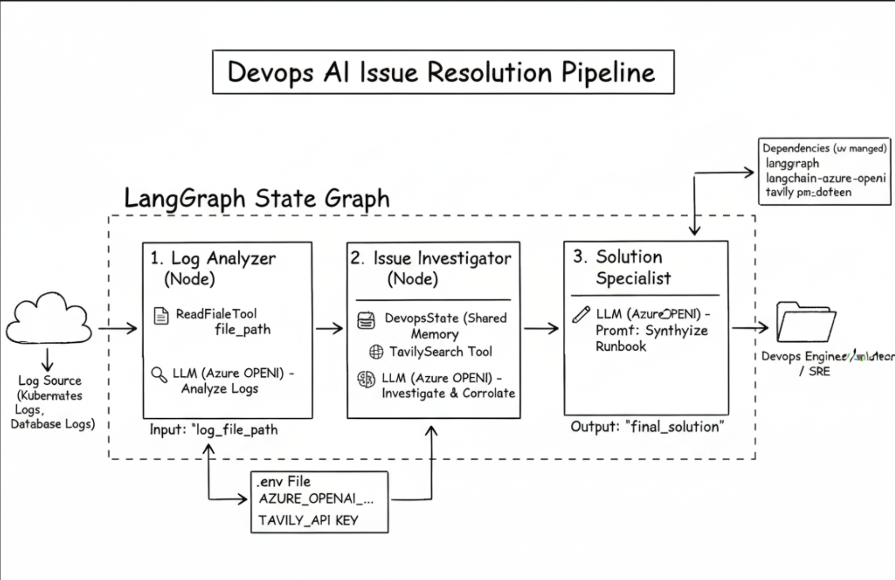

# 🛠️ AI assisted DevOps Troubleshooting

An autonomous multi-agent system built with **LangGraph** to analyze infrastructure logs, investigate root causes via web search, and generate production-ready remediation plans.

## 🌟 Introduction

This project uses **stateful graph architecture**. By using LangGraph, the system maintains a structured state across three specialized agents:

1. **Log Analyzer**: Extracts failure patterns from raw logs.
2. **Issue Investigator**: Research solutions using Tavily Search.
3. **Solution Specialist**: Drafts actionable, step-by-step runbooks.




---

## 🚀 Setup

This project uses `uv` for lightning-fast dependency management.

1. **Install uv** (if you haven't):
    ```bash
    curl -LsSf https://astral.sh/uv/install.sh | sh
    ```

2. **Clone & Enter the repo**:
    ```bash
    git clone <your-repo-url>
    cd devops-ai-graph
    ```

3. **Sync dependencies**:
    ```bash
    uv sync
    ```

4. **Run the application**:
    ```bash
    uv run main.py
    ```

---

## 📦 Dependencies

The core stack consists of:

* **LangGraph**: Orchestration of agent states.
* **LangChain Azure OpenAI**: LLM integration for enterprise-grade reasoning.
* **Tavily**: AI-optimized search engine for technical documentation.
* **Python-dotenv**: Environment variable management.

---

## 🏗️ Project Structure

```text
.
├── task_outputs/       # Generated remediation plans (.md)
├── main.py             # Entry point & Dotenv initialization
├── graph.py            # LangGraph workflow definition
├── nodes.py            # Agent logic & Prompts
├── tools.py            # File system & Search tools
├── state.py            # TypedDict state definition
├── .env                # Secrets (See below)
└── pyproject.toml      # Project config (uv)

```

---

Certainly! Updating the README to include descriptions for each variable makes it much more user-friendly, especially for team members who might be setting this up for the first time.

Here is the updated section for your `README.md`:

---

## 🔐 Environment Variables

The application requires several environment variables to function. You can find a template in `.env.example`. Create a `.env` file in the root directory and populate it with your credentials:

```ini
# --- Azure OpenAI Configuration ---
# Your secret API key found in the Azure Portal
AZURE_OPENAI_API_KEY=your_api_key_here

# The base URL for your Azure OpenAI resource (e.g., https://name.openai.azure.com/)
AZURE_OPENAI_ENDPOINT=https://your-resource.openai.azure.com/

# The custom name you gave your model deployment in Azure AI Studio
AZURE_OPENAI_DEPLOYMENT=your_deployment_name

# The specific API version to use (e.g., 2023-05-15 or 2024-02-15-preview)
AZURE_OPENAI_API_VERSION=2024-02-15-preview

# --- Search Tool ---
# API key for Tavily to allow the agent to perform web research
TAVILY_API_KEY=tvly-xxxx...
```

---

## 🛠️ Best Practices Included

* **Path Security**: `ReadFileTool` is restricted to the project `root_dir` to prevent unauthorized file access.
* **Decoupled Logic**: Nodes, tools, and state are separated for easy unit testing.
* **Concise Prompting**: Agents use structured operational prompts or better performance with GPT-4o.
* **Automated Workspace**: `main.py` automatically ensures the `task_outputs/` directory exists before execution.
